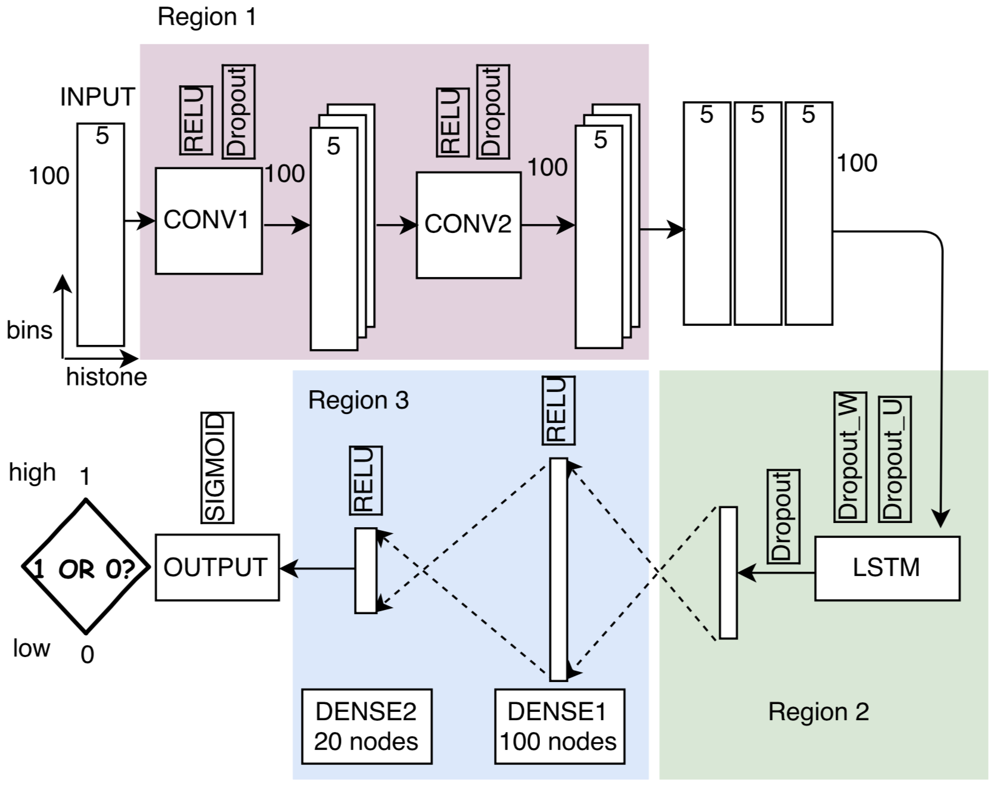

# Predicting Gene Expression Levels from Histone Modification Signals with Convolutional Recurrent Neural Networks


[Paper](https://link.springer.com/chapter/10.1007/978-981-10-5122-7_139) | [project page](https://ly-zhu.github.io/crnn)


# Datasets

The dataset can be downloaded from the [link](https://drive.google.com/uc?export=download&id=1fB3AGnluzaC8PijqTo67ES0WeFP5SBLQ). We encourage those interested to visit the original sources and site the appropriate references if they use the data.


# Script

Please change the path of dataset and cellType.txt accordingly in the file CRNN.py

    python CRNN.py


# Citation
If you find the code and dataset useful in your resarch, please cite the following paper,
```bibtex 
@incollection{zhu2017predicting,
  title={Predicting Gene Expression Levels from Histone Modification Signals with Convolutional Recurrent Neural Networks},
  author={Zhu, Lingyu and Kesseli, Juha and Nykter, Matti and Huttunen, Heikki},
  booktitle={EMBEC \& NBC 2017},
  pages={555--558},
  year={2017},
  publisher={Springer}
}
```

